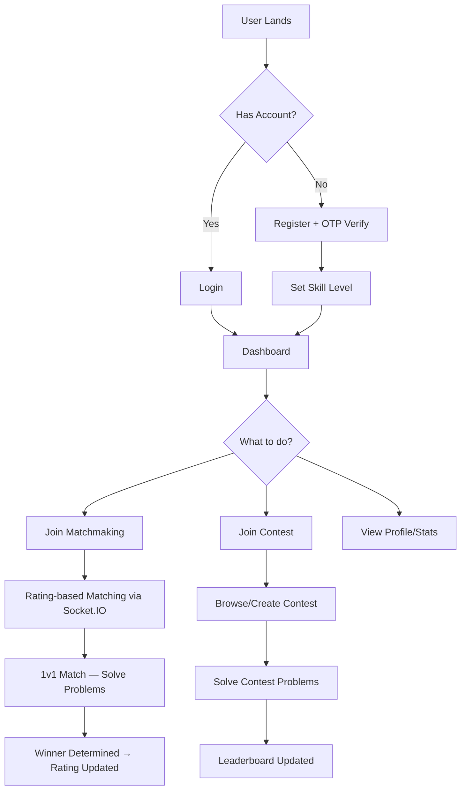
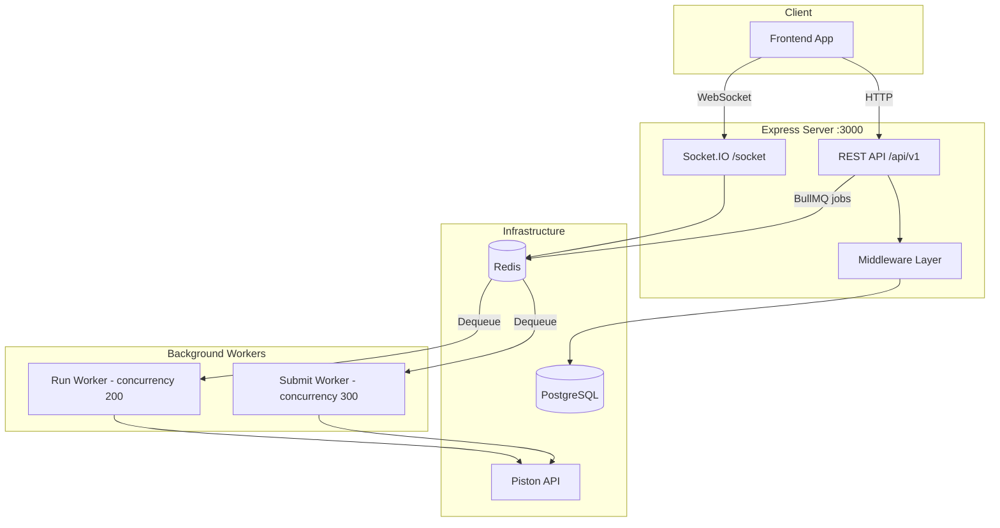
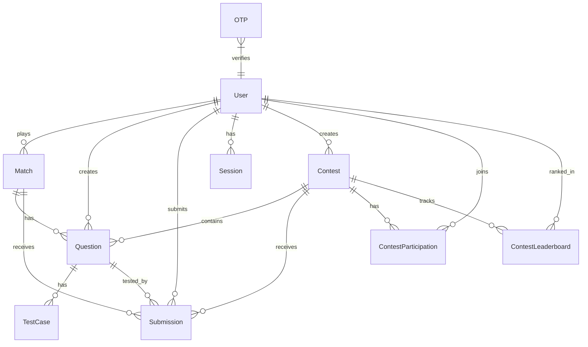
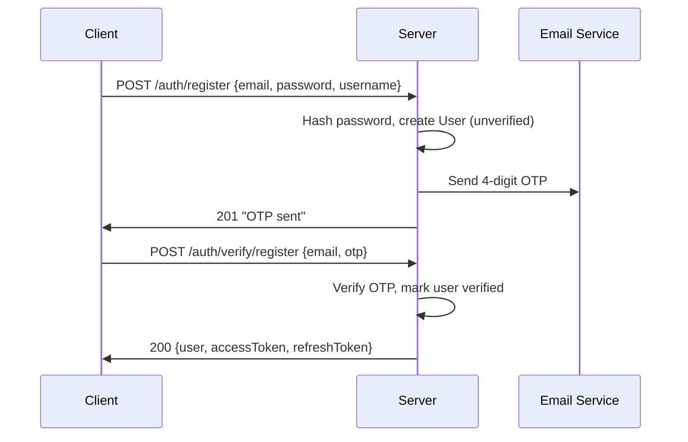
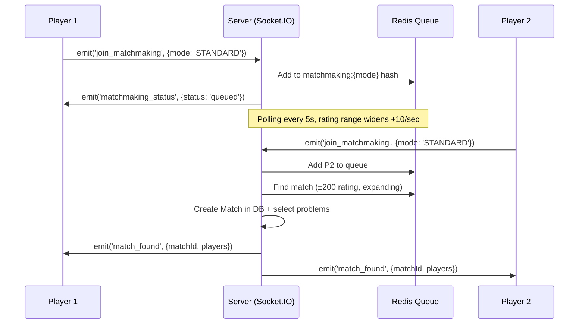
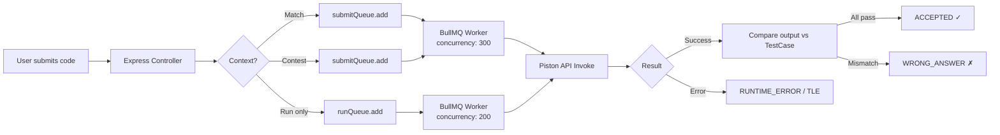

# CodeArena — Backend Documentation

> Complete technical documentation of the **CodeArena Server**, a competitive programming and real-time coding battle platform.

---

## 1. Product Overview (PRD)

### What is CodeArena?

CodeArena is a **real-time competitive programming platform** where developers can:

1. **1v1 Matches** — Get matched against opponents of similar skill level, solve coding problems in real-time, and compete head-to-head with Elo-based rating changes.
2. **Contests** — Create, host, or participate in timed coding contests with leaderboards, multiple questions, and scoring.
3. **Dashboard & Analytics** — Track performance through win/loss trends, heatmaps, leaderboards, win-streaks, and recent activity.
4. **Admin Panel** — Moderators can manage questions, contests, and participants (kick/ban users).

### Core User Flows



### Target Users

| Role | Capabilities |
|------|-------------|
| **User** | Register, login, join matches/contests, submit code, view dashboard |
| **Contest Creator** | Create contests, add questions, start/end contests, view leaderboards |
| **Admin** | Create questions for match pool, moderate contests, kick/ban users |

---

## 2. Tech Stack

| Layer | Technology |
|-------|-----------|
| **Runtime** | Node.js + TypeScript |
| **Framework** | Express.js |
| **Database** | PostgreSQL 15 (via Prisma ORM) |
| **Cache / Queue Broker** | Redis (ioredis + node-redis) |
| **Job Queue** | BullMQ (run + submit queues) |
| **Code Execution** | Piston API |
| **Real-time** | Socket.IO (WebSocket + polling) |
| **Auth** | JWT (access + refresh), bcrypt |
| **Validation** | Zod |
| **Email** | Nodemailer |
| **Containerization** | Docker + Docker Compose |

---

## 3. Architecture



### Request Pipeline

```
Client → Rate Limiter (250/15min) → Logger → CORS → JSON Parser → Router → [verifyToken] → Controller → Prisma/Redis → Response
                                                                                                            ↓ (on error)
                                                                                                     Error Handler → Log to file
```

---

## 4. Data Model

### Entity-Relationship Diagram



### Schema Summary

| Model | Key Fields | Notes |
|-------|-----------|-------|
| **User** | [id(cuid)](file:///home/x/coding/CrashCode/src/middlewares/schemaValidation.ts#47-61), `email`, `password?`, `username`, `rating(800)`, `skillLevel(enum)`, `wins`, `losses`, `winStreak`, `maxWinStreak`, `isAdmin`, `isVerified`, `version` | `version` used for JWT invalidation on logout-all |
| **Match** | [id(uuid)](file:///home/x/coding/CrashCode/src/middlewares/schemaValidation.ts#47-61), `mode(SPEED/ACCURACY/STANDARD)`, `status(WAITING/ONGOING/COMPLETED/ABORTED)`, `winnerId`, `maxDuration(3600)` | Many-to-many with [User](file:///home/x/coding/CrashCode/src/generated/prisma/client.ts#78-79) and [Question](file:///home/x/coding/CrashCode/src/generated/prisma/client.ts#58-59) |
| **Question** | [id(uuid)](file:///home/x/coding/CrashCode/src/middlewares/schemaValidation.ts#47-61), `title`, `description`, `difficulty(EASY/MEDIUM/HARD)`, `rating`, `score(100)`, `timeLimit(2000ms)`, `memoryLimit(256MB)`, `isAddedByAdmin` | Admin questions used in matchmaking pool |
| **TestCase** | [id(uuid)](file:///home/x/coding/CrashCode/src/middlewares/schemaValidation.ts#47-61), `input`, `output`, `isHidden`, `score(100)` | Belongs to Question |
| **Submission** | [id(uuid)](file:///home/x/coding/CrashCode/src/middlewares/schemaValidation.ts#47-61), [code](file:///home/x/coding/CrashCode/src/middlewares/verifyToken.ts#6-10), `language`, `status(7 verdicts)`, `executionTime`, `passedTestCases`, `totalTestCases`, `score` | Links to User, Question, Match?, Contest? |
| **Contest** | [id(uuid)](file:///home/x/coding/CrashCode/src/middlewares/schemaValidation.ts#47-61), `title`, `slug(unique)`, `status(UPCOMING/ONGOING/ENDED)`, `startTime`, `endTime`, `isPublic`, `organizationName`, `rules`, `prizes` | Creator-owned |
| **ContestParticipation** | `userId + contestId (unique)`, `score`, `rank`, `isBanned` | Join record |
| **ContestLeaderboard** | `contestId + userId (unique)`, `score`, `problemsSolved`, `rank`, `lastSubmissionTime` | Indexed for ranking queries |
| **Session** | [id(uuid)](file:///home/x/coding/CrashCode/src/middlewares/schemaValidation.ts#47-61), `token`, [refreshToken](file:///home/x/coding/CrashCode/src/controllers/auth/refreshToken.ts#7-52), `ipAddress`, `userAgent`, `device`, `browser`, `os`, `isActive` | Tracks active sessions per device |
| **OTP** | [id(uuid)](file:///home/x/coding/CrashCode/src/middlewares/schemaValidation.ts#47-61), `email`, `otp`, `expiresAt` | 4-digit, 10min TTL, indexed on `expiresAt` |

---

## 5. API Reference

> **Base URL**: `/api/v1`  
> **Auth**: All routes except `/health` and `/auth/*` require `Authorization: Bearer <accessToken>`

### 5.1 Health

| Method | Endpoint | Auth | Description |
|--------|----------|------|-------------|
| `GET` | `/health` | ✗ | Server health check |

---

### 5.2 Authentication (`/auth`)

| Method | Endpoint | Auth | Description |
|--------|----------|------|-------------|
| `POST` | `/auth/register` | ✗ | Register + send OTP. Body: `{email, password, username}` |
| `POST` | `/auth/login` | ✗ | Login with email/password. Returns access + refresh tokens |
| `POST` | `/auth/verify/register` | ✗ | Verify registration OTP. Body: `{email, otp}` |
| `POST` | `/auth/resend-otp` | ✗ | Resend OTP (30s cooldown) |
| `POST` | `/auth/email` | ✗ | Check email status |
| `POST` | `/auth/reset-password` | ✗ | Request password reset email |
| `PATCH` | `/auth/reset-password/:token` | ✗ | Reset password with token |
| `POST` | `/auth/refresh-token` | ✗ | Exchange refresh token for new access token |


**Auth Flow Diagram:**



**Token Strategy:**
- **Access Token**: 7 days, JWT with `{userId, version}`
- **Refresh Token**: 30 days, JWT with `{userId, version}`
- **Token Versioning**: `user.version` is incremented on password reset or logout-all, invalidating all existing tokens

---

### 5.3 User (`/user`) — All Protected

| Method | Endpoint | Description |
|--------|----------|-------------|
| `PATCH` | `/user/skill-level` | Set skill level once (`BEGINNER`→800, `INTERMEDIATE`→1200, `PRO`→1600) |
| `PATCH` | `/user/password` | Change password (validates old password) |
| `PATCH` | `/user/username` | Change username (min 3 chars) |
| `DELETE` | `/user/` | Delete account |
| `POST` | `/user/logoutAllDevices` | Increment version, invalidate all tokens, delete all sessions |
| `GET` | `/user/profile` | Get profile with match stats (wins, losses, winRate, streaks) |
| `GET` | `/user/submissions?page=&limit=` | Paginated submission history |
| `GET` | `/user/submissions/:id` | Single submission detail (includes code) |
| `GET` | `/user/submissions/match/:id` | Submissions for a specific match |
| `GET` | `/user/submissions/contest/:id` | Submissions for a specific contest |

---

### 5.4 Dashboard (`/user`) — Protected

| Method | Endpoint | Description |
|--------|----------|-------------|
| `GET` | `/user/leaderboard?page=&limit=` | Global leaderboard (sorted by wins) + user's rank |
| `GET` | `/user/recent-matches?mode=&page=&limit=` | Recent completed matches (filterable by mode) |
| `GET` | `/user/win-trend` | 7-day win/loss trend, fastest win, win streak, contest participation count |
| `GET` | `/user/profile/heatmap?startDate=&endDate=` | Activity heatmap (max 365 days) |
| `GET` | `/user/recent-contest?isCreated=&page=&limit=` | Recent contests (created or participated) |

---

### 5.5 Contest (`/contest`) — All Protected

| Method | Endpoint | Description |
|--------|----------|-------------|
| `POST` | `/contest/` | Create contest. Body: `{title, startTime, endTime, questionIds?, slug?, isPublic?, ...}` |
| `GET` | `/contest/my-contests` | Contests created by current user |
| `GET` | `/contest/my-contests/registered` | Contests the user has joined (paginated) |
| `GET` | `/contest/:contestId` | Contest details (response varies by status: UPCOMING/ONGOING/ENDED) |
| `PUT` | `/contest/:contestId` | Update contest |
| `DELETE` | `/contest/:contestId` | Delete contest |
| `POST` | `/contest/:contestId/join` | Join a contest (validates: not ended, not private, not already joined) |
| `POST` | `/contest/:contestId/start` | Start contest (creator/admin only, UPCOMING→ONGOING) |
| `POST` | `/contest/:contestId/end` | End contest (creator/admin only, ONGOING→ENDED, finalizes leaderboard ranks) |
| `GET` | `/contest/:contestId/status` | Contest status + participant/submission counts |
| `POST` | `/contest/:contestId/leaderboard` | Recalculate leaderboard from accepted submissions |
| `GET` | `/contest/:contestId/leaderboard?page=&limit=` | Paginated leaderboard |
| `GET` | `/contest/:contestId/rank` | Current user's rank in contest |

**Contest Question Management:**

| Method | Endpoint | Description |
|--------|----------|-------------|
| `POST` | `/contest/addQuestions` | Create new question and add to contest |
| `POST` | `/contest/addQuestionsFromLibrary` | Add existing question to contest |
| `PUT` | `/contest/updateQuestions` | Update contest question |
| `DELETE` | `/contest/deleteQuestions` | Remove question from contest |
| `GET` | `/contest/questions/all` | Get all questions for a contest |

**Contest Code Execution:**

| Method | Endpoint | Description |
|--------|----------|-------------|
| `POST` | `/contest/:contestId/questions/:questionId/run` | Run code with custom input (queued via BullMQ → Piston API) |
| `POST` | `/contest/:contestId/questions/:questionId/submit` | Submit solution — runs all test cases, creates Submission, updates leaderboard if ACCEPTED |
| `GET` | `/contest/:contestId/questions/:questionId/submissions` | User's submissions for a specific question in a contest |

> [!IMPORTANT]
> **Contest Detail Response varies by status:**
> - **UPCOMING**: Only creator sees question IDs; participants see basic info
> - **ONGOING**: All participants see full question details + their submission stats
> - **ENDED**: Everyone sees questions with non-hidden test cases + top 10 performers

---

### 5.6 Match (`/match`) — Protected

| Method | Endpoint | Description |
|--------|----------|-------------|
| `POST` | `/match/run` | Run code with custom input (quick test — no match context required) |
| `POST` | `/match/submit` | Submit solution for a match question — runs test cases, updates game state via Socket.IO, triggers game end if all problems solved |

---

### 5.7 Question (`/question`) — Protected

| Method | Endpoint | Description |
|--------|----------|-------------|
| `GET` | `/question/:problemId` | Get question details by ID |

---

### 5.8 Admin (`/admin`) — Protected + Admin Check

| Method | Endpoint | Description |
|--------|----------|-------------|
| `POST` | `/admin/questions` | Create question for the global pool (`isAddedByAdmin: true` — used in matchmaking) |
| `GET` | `/admin/contests?status=&page=&limit=` | List all contests with real-time status, filterable by `UPCOMING/ONGOING/ENDED` |
| `GET` | `/admin/contests/:contestId/leaderboard` | Admin view of contest leaderboard |
| `GET` | `/admin/contests/:contestId/user-details/:participantId` | View participant submissions, scores, passed/failed test cases |
| `POST` | `/admin/contests/:contestId/kick/:participantId` | Remove participant from leaderboard |
| `POST` | `/admin/contests/:contestId/ban/:participantId` | Ban participant (removes from leaderboard + sets `isBanned: true`, blocks further submissions) |

---

## 6. Real-Time System (Socket.IO)

> **Path**: `/socket`  
> **Auth**: Token verified via [verifySocketToken](file:///home/x/coding/CrashCode/src/middlewares/verifySocketToken.ts#5-41) middleware  
> **Transports**: WebSocket + Polling

### 6.1 Matchmaking Flow



**Matchmaking Config:**
- **Rating Range**: ±200 (expands by +10 per second of wait time)
- **Queue Check Interval**: 5 seconds
- **Max Queue Time**: 30 seconds (timeout emitted)
- **Problem Selection**: Admin-created questions — SPEED mode gets 1 problem, STANDARD gets 3 (easy/medium/hard)

### 6.2 Game Lifecycle

| Event (Client→Server) | Description |
|----------------------|-------------|
| `join_matchmaking` | Enter matchmaking queue with `{mode}` |
| `leave_matchmaking` | Leave queue |
| `join_match` | Join a match room after `match_found` |
| `start_game` | Trigger game start (requires all players joined) |
| `get_game_state` | Request current game state |
| `rejoin_match` | Rejoin after disconnect (clears abandon timer) |

| Event (Server→Client) | Description |
|----------------------|-------------|
| `matchmaking_status` | Queue confirmation |
| `matchmaking_timeout` | No match found in 30s |
| `match_found` | Match created with `{matchId, players}` |
| `match_state` | Match details on join |
| `game_start` | Game begins with problem IDs and initial state |
| `game_state` | Current game state (on request/rejoin) |
| `game_state_update` | Real-time update when a player solves a problem |
| `game_end` | Winner + rating changes |
| `player_disconnected` | Player went offline (60s reconnect window) |
| `player_abandoned` | Player failed to reconnect → opponent wins |
| `match_aborted` | Player failed to join within 60s |

### 6.3 Rating System

Uses **Elo rating** with K-factor of 32:

```
Expected Score = 1 / (1 + 10^((loserRating - winnerRating) / 400))
Rating Change  = round(32 × (1 - expectedScore))
```

After a match: winner gains, loser loses the same `ratingChange`. Skill level auto-adjusts:
- **BEGINNER**: < 1200
- **INTERMEDIATE**: 1200–1599
- **PRO**: ≥ 1600

---

## 7. Code Execution Pipeline



**Supported Languages**: Python, JavaScript, Java, C, C++

**Queue Configuration:**
- **runQueue**: For `run` (custom input) — concurrency 200, 3 retries with exponential backoff
- **submitQueue**: For `submit` (all test cases) — concurrency 300, 3 retries with exponential backoff
- Both queues: `removeOnComplete: true`, `removeOnFail: true`

**Submission Verdicts**: `PENDING`, `ACCEPTED`, `WRONG_ANSWER`, `TIME_LIMIT_EXCEEDED`, `MEMORY_LIMIT_EXCEEDED`, `RUNTIME_ERROR`, `COMPILATION_ERROR`

---

## 8. Middleware

| Middleware | File | Purpose |
|-----------|------|---------|
| **verifyToken** | [verifyToken.ts](file:///home/x/coding/CrashCode/src/middlewares/verifyToken.ts) | JWT validation + version check against DB |
| **validateRequest** | [schemaValidation.ts](file:///home/x/coding/CrashCode/src/middlewares/schemaValidation.ts) | Zod schema validation (register, login, resetPassword, changePassword) |
| **errorHandler** | [errorHandler.ts](file:///home/x/coding/CrashCode/src/middlewares/errorHandler.ts) | Centralized error handler — logs to `src/logs/errors.txt`, returns `{success: false, error}` |
| **logRequest** | [logRequests.ts](file:///home/x/coding/CrashCode/src/middlewares/logRequests.ts) | Request logging |
| **registerOtp / loginOtp** | [otp.ts](file:///home/x/coding/CrashCode/src/middlewares/otp.ts) | Sets `req.type = 'register'/'login'` for OTP flow |
| **verifySocketToken** | [verifySocketToken.ts](file:///home/x/coding/CrashCode/src/middlewares/verifySocketToken.ts) | Socket.IO auth middleware — attaches `userId` and `rating` to `socket.data` |
| **Rate Limiter** | Inline in [index.ts](file:///home/x/coding/CrashCode/src/index.ts) | 250 requests per 15 minutes per IP |

**Validation Schemas (Zod):**
- **Password**: Min 8 chars, 1 uppercase, 1 number, 1 special character
- **Email**: Min 6 chars, valid format
- **Username**: Min 3 chars

---

## 9. Background Jobs & Cleanup

| Job | Interval | Purpose |
|-----|----------|---------|
| **OTP Cleanup** | On setup | Deletes expired OTPs (via PostgreSQL function) |
| **Session Cleanup** | Every 60s | Deletes sessions where `refreshTokenExpiresAt < NOW()` |
| **Contest Status Cleanup** | Every 5min | PostgreSQL function transitions `UPCOMING→ONGOING` and `ONGOING→ENDED` based on time. Uses optimized index on [(status, startTime, endTime)](file:///home/x/coding/CrashCode/src/generated/prisma/internal/class.ts#201-210) |

All cleanup jobs are initialized on DB connection in [prisma.ts](file:///home/x/coding/CrashCode/src/config/prisma.ts).

---

## 10. Infrastructure

### Docker Compose (Development)

| Service | Image | Port | Purpose |
|---------|-------|------|---------|
| **app** | Custom (Dockerfile.dev) | 3000 | Express + Socket.IO server |
| **db** | postgres:15-alpine | 5432 | PostgreSQL database |
| **pgadmin** | dpage/pgadmin4 | 5050 | Database admin UI |
| **redis** | redis:latest | 6379 | Cache + BullMQ broker + matchmaking queues |
| **redis-commander** | rediscommander | 8081 | Redis admin UI |

**Network**: `codearena-network` (external)

### Environment Variables

| Category | Variables |
|----------|----------|
| **Database** | `POSTGRES_USER`, `POSTGRES_PASSWORD`, `POSTGRES_DB`, `POSTGRES_PORT`, `DATABASE_URL` |
| **Auth** | `ACCESS_TOKEN_SECRET`, `REFRESH_TOKEN_SECRET`, `RESET_PASSWORD_TOKEN_SECRET`, `TEMP_JWT_SECRET` |
| **Execution** | `PISTON_URL` |
| **App** | `PORT`, `FRONTEND_URL`, `BASE_URL`, `REDIS_URL` |

---

## 11. Project Structure

```
CrashCode/
├── prisma/
│   └── schema/
│       ├── schema.prisma          # Prisma config (PostgreSQL + schema folder preview)
│       ├── User.prisma            # User + Skill enum
│       ├── Match.prisma           # Match + MatchMode/MatchStatus enums
│       ├── Question.prisma        # Question + TestCase + Difficulty enum
│       ├── Submission.prisma      # Submission + SubmissionStatus enum
│       ├── contest.prisma         # Contest + ContestParticipation + ContestLeaderboard
│       ├── Session.prisma         # Session tracking
│       └── Otp.prisma             # OTP records
├── src/
│   ├── index.ts                   # Entry point — Express + Socket.IO + rate limiting
│   ├── config/
│   │   ├── prisma.ts              # Prisma client + DB connection + cleanup init
│   │   └── redis.ts               # Redis client
│   ├── routes/
│   │   ├── route.ts               # Primary router — mounts all sub-routers
│   │   ├── auth.ts                # Auth routes (public)
│   │   ├── user.ts                # User routes (protected)
│   │   ├── match.ts               # Match routes (protected)
│   │   ├── contest.ts             # Contest routes (protected)
│   │   ├── question.ts            # Question routes (protected)
│   │   ├── admin.routes.ts        # Admin routes (protected + admin check)
│   │   └── health.ts              # Health check (public)
│   ├── controllers/
│   │   ├── auth/                  # Register, Login, OTP, Reset Password, Refresh Token
│   │   ├── user/                  # Profile settings, Submissions
│   │   ├── contest/               # Contest CRUD, Questions, Leaderboard, Code Submit
│   │   ├── dashboard/             # Leaderboard, Recent Matches, Win Trend, Heatmap
│   │   ├── question/              # Get question by ID
│   │   ├── admin/                 # Admin question creation, contest moderation
│   │   └── submission.controller  # Match-based code run/submit with Socket.IO integration
│   ├── middlewares/
│   │   ├── verifyToken.ts         # JWT auth middleware
│   │   ├── schemaValidation.ts    # Zod validation schemas
│   │   ├── errorHandler.ts        # Central error handler
│   │   ├── otp.ts                 # OTP type middleware
│   │   └── verifySocketToken.ts   # Socket.IO auth
│   ├── socket/
│   │   ├── socket.ts              # Socket.IO initialization + event handlers
│   │   ├── handlers/              # matchmaking, match, game, disconnect
│   │   ├── services/              # matchmakingService, gameService, getProblems
│   │   └── types/                 # Problem, TestCase, PlayerState interfaces
│   ├── queues/
│   │   ├── queues.ts              # BullMQ queue definitions (run + submit)
│   │   └── workers.ts             # Workers that invoke Piston API

│   ├── utility/
│   │   ├── contestStatusCleanup   # Auto-transition contest statuses
│   │   ├── sessionCleanup.ts      # Delete expired sessions
│   │   ├── setupOtpCleanup.ts     # Delete expired OTPs
│   │   ├── sendEmail.ts           # Nodemailer wrapper
│   │   └── slugGenerator.ts       # URL-friendly slug generation
│   └── types/
│       ├── customError.ts         # CustomError class with statusCode
│       ├── customRequest.ts       # Extended Request with user.id, user.version
│       └── customOtpRequest.ts    # Extended Request with OTP type
├── docker-compose-development.yml
├── Dockerfile.dev / Dockerfile.prod
├── Makefile
└── package.json
```
